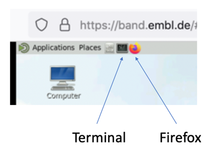

# OME_Zarr_Tools

## About

This repository contains materials for the practical on "Cloud hosted image data and cloud infrastructures" on 08.04.23 as part of the [Defragmentation Training School 2](https://eubias.org/NEUBIAS/neubias2020-conference/portugal-2023/program-porto-2023-2/). The materials demonstrate working with OME-Zarr data located in S3 buckets. 

## Connect to the BAND cloud computer

In this practical we are using the [BAND](https://band.embl.de/#/eosc-landingpage) cloud computing.

#### Connect the first time

To connect to the BAND, please follow these steps:

- Go to the [BAND](https://band.embl.de/#/eosc-landingpage) web site
- Read the [user guide](https://docs.google.com/document/d/1TZBUsNIciGMH_g4aFj2Lu_upISxh5TV9FBMrvNDWmc8/edit?usp=sharing)
- Accept the terms of usage, to activate the login button
- `[ Login ]`
  - Please use your Google account
- Choose 4 CPU and 16 GB memory
- `[ Launch ]`
- On the same page below, now `[ Go to Desktop ]`

#### Re-connect to a session

If you did not stop the recent session you can simply

- Go to the [BAND](https://band.embl.de/#/eosc-landingpage) web site
- `[ Go to Desktop ]`

## Software installation

https://docs.google.com/document/d/17a0w8hPPNX6SV4UiK6uCWKXnKtN5aKno-dxROUDcoO8/edit

For this practical we need several software to be installed:

+ **bf2raw** environment containing the bioformats2raw package, which can be used to convert images into OME-Zarr format.

+ **minio** environment containing the minio client mc, which enables interaction with s3 buckets.

+ **nflow** environment containing the workflow management system nextflow.

+ **ZarrSeg** environment containing the napari package along with dependencies/plugins to support OME-Zarr format
and our command line tool, ZarrSeg, for segmentation of OME-Zarr data.

+ **fiji** exectuable containing a plugin for opening the OME-Zarr format.

+ **batchconvert** executable for parallelised conversion of image data and file transfer between the local filesystem and the s3 buckets.

To install the software you will need to launch your BAND cloud computer (see above) and use Firefox and the terminal window.




Please follow those steps:

1. Launch the BAND cloud computer (see instructions above)
1. Open a Terminal window (see screenshot above)
1. Open Firefox (see screenshot above) on the BAND.
1. In Firefox browse to the Google Doc shared with you, which contains the installation command (you need to type the address starting with `tinyurl...` into the Firefox search bar and press enter)
1. Copy the "Initial Installation" command (starting with `cd ~ ...`) from the Google Doc into the Terminal window and press enter
1. This can take about 10-20 minutes.
1. It should finish with the message: `Configuration of the default s3 credentials for 'zseg' is complete.`

## Practical

In general, everything that is formatted like this: `command bla bla` should be copy-pasted into the BAND terminal window and enter should be pressed to execute that code.

Although we are doing this practical on a cloud computer, you should be able to reproduce all of this on a local (Linux) computer. [Here are the installation instructions]([https://git.embl.de/oezdemir/course_scripts/-/tree/main/installation](https://github.com/bugraoezdemir/OME_Zarr_Tools/blob/main/install.sh)), which you may have to modify a bit, but the conda installation parts should work on any system. Let us know if you need help with that!

### Inspection of the remote datasets

Check out what we have at our s3 bucket:

``` 
mc tree -d 3 s3/ome-zarr-course/
``` 
``` 
mc ls s3/ome-zarr-course/data/MFF/
``` 
``` 
mc ls s3/ome-zarr-course/data/JPEG/
```
``` 
mc ls s3/ome-zarr-course/data/ZARR/common/
```

Check out the multiscales metadata for one of the existing OME-Zarr datasets:
``` 
mc cat s3/ome-zarr-course/data/ZARR/common/13457537T.zarr/.zattrs
```

Check out the array metadata for the highest resolution array:
``` 
mc cat s3/ome-zarr-course/data/ZARR/common/13457537T.zarr/0/.zarray
```

```
ome_zarr info https://s3.embl.de/ome-zarr-course/data/ZARR/common/13457537T.zarr
```

### Creation of OME-Zarr from remote data

The remote datasets can be converted in a parallelised manner by using the `batchconvert` tool. 

#### First check out what data we have the s3 end:
```
mc tree -d 2 s3/ome-zarr-course/
```

#### Independent conversion of the input files:
The followin command will map each input file in the `data/MFF` folder to a single OME-Zarr series, which will be located in a specific directory for each user. 

```
batchconvert omezarr -st s3 -dt s3 --drop_series data/MFF data/ZARR/$USER;
```
Note that the `-st s3` option will make sure that the input path is searched for in the s3 bucket, while `-dt s3` will trigger the output files to be transferred to the s3 bucket under the output path.

#### Grouped conversion mode:

Another conversion mode will assume that the input files are part of the same series and thus will merge them along a specific axis during the conversion process.
```
batchconvert omezarr -st s3 -dt s3 --drop_series --merge_files --concatenation_order t data/JPEG data/ZARR/$USER;
```
The `merge_files` flag will ensure the grouped conversion option and the `--concatenation_order t` option will make sure that the files will be merged along the time channel. 

#### Check what has changed at the s3 end after the conversion:
```
mc tree -d 2 s3/ome-zarr-course/
```
```
mc ls s3/ome-zarr-course/data/ZARR/$USER/
```

#### Copy the converted Zarr data to the home folder
```
mc mirror s3/ome-zarr-course/data/ZARR/$USER ~/data/ZARR;
```

### Visualisation

#### Napari

Visualise the remote data using Napari together with the napari-ome-zarr plugin.
```
napari --plugin napari-ome-zarr https://s3.embl.de/ome-zarr-course/data/ZARR/$USER/xyzct_8bit__mitosis.ome.zarr
```
Optional: visualise the local OME-Zarr data:
```
napari --plugin napari-ome-zarr ~/data/ZARR/xyzct_8bit__mitosis.ome.zarr
```

#### Fiji
fiji ;
[ Plugins > BigDataViewer > OME-Zarr > Open OME-Zarr from S3...]

S3 URL: https://s3.embl.de/ome-zarr-course/data/ZARR/$USER/xyzct_8bit__mitosis.ome.zarr

Observe the output in the console window while your are browsing around. You can see how chunks of data for fetched on demand (aka lazy-loading). This makes it possible to smoothly browse TB sized cloud hosted image data on any computer.

S3 URL: https://s3.embl.de/i2k-2020/platy-raw.ome.zarr


#### Web based viewing options
Please open Google Chrome on the BAND (for some reason this does not work with Firefox on the BAND).

https://kitware.github.io/itk-vtk-viewer/app/?fileToLoad=https://s3.embl.de/ome-zarr-course/data/ZARR/<$USER>/xyz_8bit__nucleus.ome.zarr 

https://hms-dbmi.github.io/vizarr/?source=https://s3.embl.de/ome-zarr-course/data/ZARR/<$USER>/xyzct_8bit__mitosis.ome.zarr 

**add vizarr and neuroglancer**

### Segmentation 

We can also segment remotely located OME-Zarr data without explicitly downloading it.
#### Examine the dataset that is to be segmented:
```
mc tree -d 2 s3/ome-zarr-course/data/ZARR/$USER/23052022_D3_0002_positiveCTRL.ome.zarr
```
#### Also view the data
```
napari --plugin napari-ome-zarr https://s3.embl.de/ome-zarr-course/data/ZARR/$USER/23052022_D3_0002_positiveCTRL.ome.zarr;
```

#### Segment each channel
We can use the zseg package for segmenting the data via thresholding.
```
zseg threshold -r -m otsu -c 1 -ch 0 -n otsu-c1-ch0 --colormap viridis ome-zarr-course/data/ZARR/$USER/23052022_D3_0002_positiveCTRL.ome.zarr;
```
In this command, the `-r` flag ensures that the input path is searched at the s3 bucket. The `-m` option specifies the thresholding algorithm, which in this case is the Otsu algorithm. The `c` is a coefficient that is multiplied with the found threshold value to get the effective threshold. The `-ch` species the channel 0 for segmentation. The `-n` option specifies the name of the label path created. \

Now also segment the other channel:
```
zseg threshold -r -m otsu -c 1 -ch 1 -n otsu-c1-ch1 --colormap viridis ome-zarr-course/data/ZARR/$USER/23052022_D3_0002_positiveCTRL.ome.zarr;
```
Note that the `-c` argument has been changed.

#### Have a look at the segmented data 
```
napari --plugin napari-ome-zarr https://s3.embl.de/ome-zarr-course/data/ZARR/$USER/23052022_D3_0002_positiveCTRL.ome.zarr;
```

It is also possible to apply binary postprocessing to the segmented data.
#### Apply mathematical morphology
```
zseg postprocess -r -m binary_opening -f 1,1 -l otsu-c1-ch1 --colormap viridis ome-zarr-course/data/ZARR/$USER/23052022_D3_0002_positiveCTRL.ome.zarr;
```
Here the `-m` specifies the postprocessing method; the `-f` determines the footprint shape. Depending on the shape of the input data, it can be 2 or 3-dimensional. The `-l` can be used to decide on the name of the label image, that is subjected to the postprocessing. 

#### Now examine the OME-Zarr data:
```
mc tree -d 2 s3/ome-zarr-course/data/ZARR/$USER/23052022_D3_0002_positiveCTRL.ome.zarr
```
```
ome_zarr info https://s3.embl.de/ome-zarr-course/data/ZARR/$USER/23052022_D3_0002_positiveCTRL.ome.zarr
```
Also visualise the data:
```
napari --plugin napari-ome-zarr https://s3.embl.de/ome-zarr-course/data/ZARR/$USER/23052022_D3_0002_positiveCTRL.ome.zarr;
```


